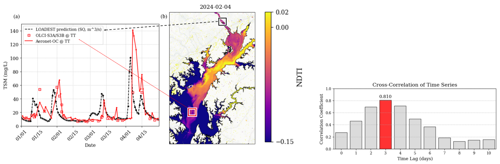

# AERONET-OC Analysis: Timeseries, Cross Correlation, and Comparison with Multi- and Hyperspectral satellites
This repo contains code used for AERONET-OC analysis over the **Tolchester Tower AERONET-OC Site** (2021-2025).

  

